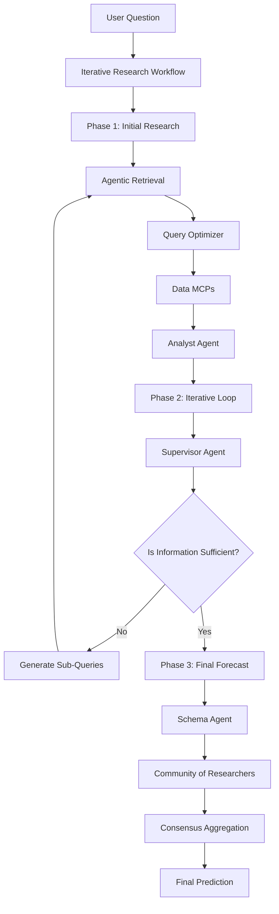

# AG Forecast Bot - Knowledge Transfer Documentation

> **Comprehensive Guide to the AGForecast Bot Architecture and Custom Implementations**

## Table of Contents

1. [Overview](#overview)
2. [System Architecture](#system-architecture)
3. [Core Components](#core-components)
4. [Workflows - Agentic Retrieval](#workflows---agentic-retrieval)
5. [Workflows - Query Optimizer](#workflows---query-optimizer)
6. [Workflows - Agent Types](#workflows---agent-types)
7. [Data MCPs](#data-mcps)
8. [Custom Additions & Innovations](#custom-additions--innovations)

---

## Overview

The **AG Forecast Bot** is a sophisticated multi-agent forecasting system designed to answer probabilistic questions by combining iterative research, agentic retrieval, and ensemble forecasting. The system leverages multiple AI agents working in parallel to produce well-reasoned forecasts backed by real-time internet research.

### Key Design Principles

1. **Agentic Autonomy**: The system decides when to retrieve information, what queries to run, and when research is sufficient
2. **Query Optimization**: All search queries are dynamically optimized for their target data source
3. **Multi-Agent Ensemble**: Multiple researcher agents independently analyze data and produce forecasts
4. **Mathematical Rigor**: Each forecast must include a mathematical model with probability distributions
5. **Structured Output**: All agent outputs use Pydantic schemas for type safety and validation

---

## System Architecture

### High-Level Flow



### Component Hierarchy

```
IterativeResearchWorkflow (Orchestrator)
├── AgenticRetrieval
│   ├── QueryOptimizer
│   └── Data MCPs (google_search, perplexity, asknews, etc.)
├── AnalystAgent
├── SupervisorAgent
├── SchemaAgent
├── Community
│   └── ResearcherAgent[] (Multiple instances)
└── Consensus (MeanConsensus, MedianConsensus, etc.)
```

---

## Core Components

### IterativeResearchWorkflow (Main Implementation)

**Location**: [ag_forecast/src/workflows/iterative_research.py](file:///home/ubuntu/kairosity_bot_final/ag_forecast/src/workflows/iterative_research.py)

The **main AG Forecast Bot** implementation.

```python
class IterativeResearchWorkflow:
    def __init__(self, retrieval, analyst_agent, supervisor, 
                 schema_agent, community, consensus, 
                 max_loop_rounds=3, logger=None)
```

#### **Phase 1: Initial Research**

1. **Initial Retrieval**: Run `AgenticRetrieval` to gather broad context
2. **Initial Analysis**: `AnalystAgent` analyzes retrieved data

```python
retrieval_result = await self.retrieval.run(user_query, current_date, parent_ids=[])
analysis_result = await self.analyst_agent.run(user_query, initial_context, ...)
global_context.append(f"--- Initial Research ---\nQuery: {user_query}\nAnalysis: {analysis_result['analysis']}")
```

#### **Phase 2: Iterative Loop** (Up to 3 rounds)

1. **Supervisor Review**: Reviews context, decides if more info needed
2. **Generate Sub-Queries**: If insufficient, generates up to 3 targeted queries
3. **Process Sub-Queries**: Run retrieval + analysis for each in parallel
4. **Update Context**: Add all sub-query analyses to global context

```python
for round_num in range(self.max_loop_rounds):
    supervisor_result = await self.supervisor.run(user_query, context_str, ...)
    if supervisor_result["is_sufficient"]:
        break
    
    # Process sub-queries in parallel
    sub_query_tasks = [self._process_sub_query(sq["query"], ...) for sq in supervisor_result["sub_queries"]]
    sub_query_results = await asyncio.gather(*sub_query_tasks)
    
    for res in sub_query_results:
        global_context.append(f"--- Sub-query: {res['query']} ---\nAnalysis: {res['analysis']}")
```

#### **Phase 3: Final Forecast**

1. **Schema Definition**: `SchemaAgent` determines prediction format
2. **Community Forecasting**: Run all researchers in parallel
3. **Consensus**: Aggregate predictions using mean/median/weighted

```python
schema_result = await self.schema_agent.run(user_query, final_context_str, ...)
community_results = await self.community.run(user_query, final_context_str, ..., schema_result)
aggregated_prediction = self.consensus.aggregate(predictions)
```

---

## Workflows - Agentic Retrieval

**Location**: [ag_forecast/src/workflows/agentic_retrieval.py](file:///home/ubuntu/kairosity_bot_final/ag_forecast/src/workflows/agentic_retrieval.py)

**Purpose**: Autonomously decide what information to retrieve and when to stop.

### Architecture

- **Max Rounds**: Default 3 iterations
- **Context Building**: Maintains Q&A pairs from all previous searches
- **Sufficiency Check**: After each round, decides if more info needed

### Execution Flow (Per Round)

**1. Reasoning Step**: Agent analyzes context and generates search queries

```python
class RetrievalStep(BaseModel):
    reasoning: str
    search_queries: List[SearchQuery]  # query, rationale, source
    is_sufficient: bool
```

**Dynamic Prompt**: [get_agentic_retrieval_user_prompt](file:///home/ubuntu/kairosity_bot_final/ag_forecast/src/prompts.py#L11-L94) adapts based on available MCPs

The agent sees:
- Current query
- Previous Q&A pairs
- **Available sources with pros/cons**:
  - **google_search**: Fast, snippets only, temporal filtering
  - **google_scrape**: Full content, slower, expensive
  - **perplexity_search**: Advanced filtering (domains, dates)
  - **perplexity_sonar**: AI synthesis with citations
  - **asknews**: News aggregation
  - **duckduckgo**: Simple search

**2. Query Optimization**: Pass queries to `QueryOptimizer`

```python
optimized_queries = await self.query_optimizer.optimize_queries(
    step_plan.search_queries, user_query, current_date
)
```

**3. Parallel Execution**: Execute all optimized queries concurrently

```python
search_tasks = [(mcp.search(opt_query.query, **opt_query.kwargs)) for opt_query in optimized_queries]
results = await asyncio.gather(*search_tasks, return_exceptions=True)
```

**4. Build Q&A Pairs**:

```python
qa_pairs.append({
    "query": original_query.query,
    "answer": "\n".join([item.get("content", "") for item in result]),
    "source": original_query.source
})
```

**5. Final Summary**: Generate comprehensive summary from all Q&A pairs

```python
final_context = "\n\n".join([
    f"Search Query: {qa['query']}\nAnswer: {qa['answer']}\nSource: {qa['source']}" 
    for qa in qa_pairs
])

final_summary = await self.backend.generate(summary_messages)
```

### Custom Addition: Dynamic Source Prompts

**What**: Prompt adapts based on available MCPs  
**Why**: Different deployments have different APIs  
**Implementation**: [prompts.py:L11-94](file:///home/ubuntu/kairosity_bot_final/ag_forecast/src/prompts.py#L11-L94)

```python
def get_agentic_retrieval_user_prompt(sources: list) -> str:
    source_guide = {
        "google_search": {
            "pros": "Fast, comprehensive coverage, temporal filtering",
            "cons": "Only snippets, rate limits",
            "best_for": "Quick overview, news headlines"
        },
        # ... more sources
    }
    
    available_sources_text = "\n\n**AVAILABLE SOURCES:**\n"
    for source in sources:
        info = source_guide[source]
        available_sources_text += f"**{source}** - {info['description']}\n"
    
    return full_prompt_with_sources
```

---

## Workflows - Query Optimizer

**Location**: [ag_forecast/src/workflows/query_optimizer.py](file:///home/ubuntu/kairosity_bot_final/ag_forecast/src/workflows/query_optimizer.py)

**Purpose**: Transform generic queries into source-optimized queries with proper kwargs.

### Core Concept

Different sources need different query formats:
- **Google**: "US inflation rate 2024 CPI data" (keywords)
- **Perplexity Sonar**: "What is the current US inflation rate?" (natural language)
- **Perplexity Search**: Structured with domain/date filtering

### Schema

```python
class OptimizedSearchQuery(BaseModel):
    query: str  # Optimized query text
    kwargs: Dict[str, Union[str, int, float, bool, list, None]]
    reasoning: str

class MultiOptimizedQueries(BaseModel):
    queries: List[OptimizedSearchQuery]  # 1-3 queries
    should_expand: bool  # Whether expansion happened
```

### Source-Specific Optimizations

#### Google Search

**Prompt**: [GOOGLE_SEARCH_OPTIMIZATION_PROMPT](file:///home/ubuntu/kairosity_bot_final/ag_forecast/src/prompts.py#L123-L187)

**Optimizations**:
1. Transform to keyword format
2. Extract temporal context from forecasting query
3. Populate kwargs: `is_news`, `date_before`, `max_results`
4. Suggest domain operators (site:fred.stlouisfed.org)
5. Multi-query expansion for complex topics

#### Perplexity Search

**Prompt**: [PERPLEXITY_SEARCH_OPTIMIZATION_PROMPT](file:///home/ubuntu/kairosity_bot_final/ag_forecast/src/prompts.py#L267-L357)

**Powerful Features**:
```python
{
    "search_recency_filter": "day" | "week" | "month" | "year",
    "search_after_date": "MM/DD/YYYY",
    "search_before_date": "MM/DD/YYYY",
    "search_domain_filter": ["federalreserve.gov", "imf.org"],  # or ["-reddit.com"]
    "country": "US",
    "max_tokens_per_page": 2048
}
```

#### Perplexity Sonar

**Natural language questions with kwargs**:
```python
{
    "temperature": 0.1-0.2,  # Factual
    "return_citations": True,  # ALWAYS for forecasting
    "return_images": True,  # For charts/graphs
    "return_related_questions": True
}
```

### Custom Addition: Multi-Query Expansion

**What**: Single query → 2-3 complementary queries  
**Why**: Complex topics need multiple angles (historical + current + forecasts)

**Example**:
```
Input: "inflation forecast 2025"

Output:
[
  {query: "US inflation trends 2024", kwargs: {recency: "month", domains: ["bls.gov"]}},
  {query: "Fed inflation forecast 2025", kwargs: {domains: ["federalreserve.gov"]}},
  {query: "inflation indicators 2024", kwargs: {domains: ["fred.stlouisfed.org"]}}
]
```

---

See [KT_PART2.md](file:///home/ubuntu/kairosity_bot_final/ag_forecast/KT_PART2.md) for agent types, data MCPs, and custom innovations.
